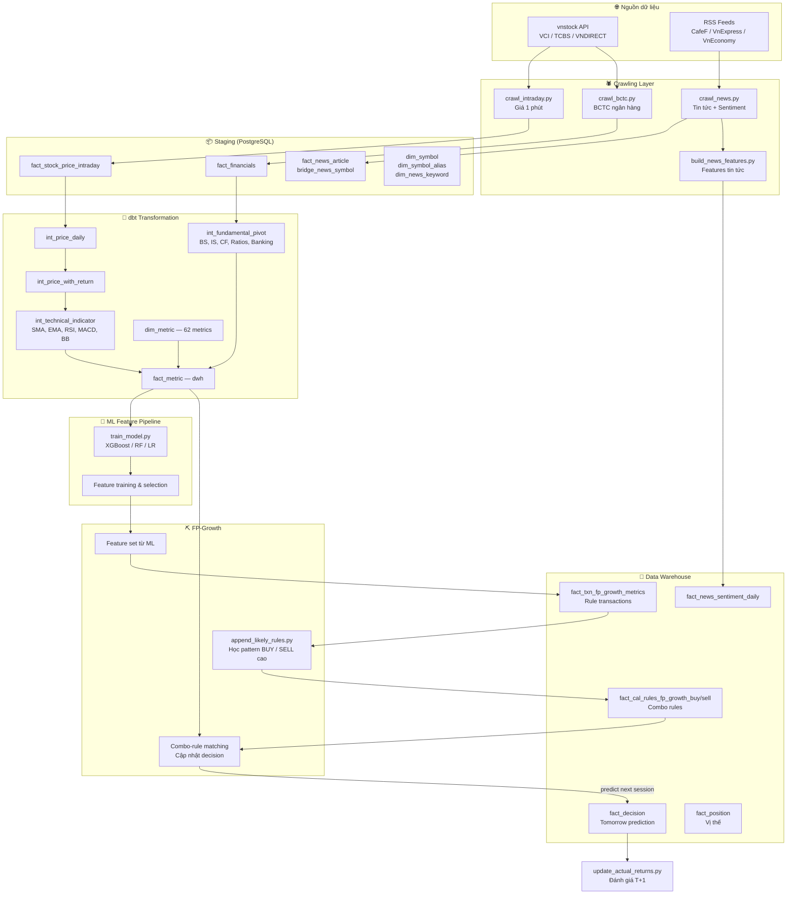
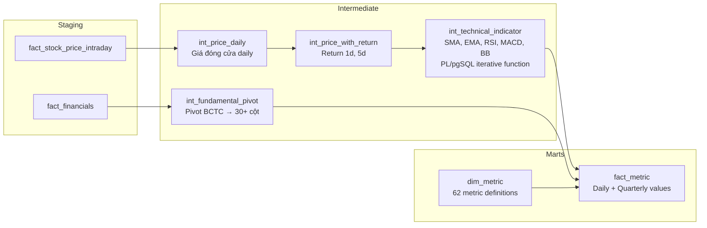
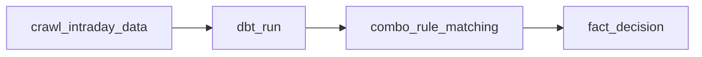
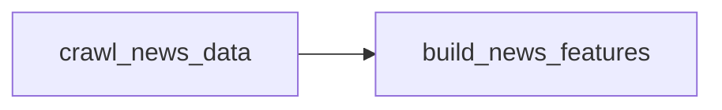
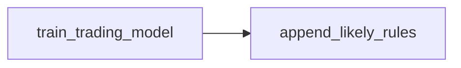

# 📊 Stock Trading AI Pipeline — Tài liệu tổng quan dự án

> **Mục tiêu**: Hệ thống end-to-end tự động crawl dữ liệu chứng khoán, xây dựng features, huấn luyện mô hình ML dự đoán tín hiệu giao dịch (BUY / SELL / SILENT) cho **phiên giao dịch kế tiếp (T+1)**, sau đó dùng combo rule FP-Growth để quét tín hiệu xác nhận.

> [!IMPORTANT]
> **Luôn kích hoạt virtual environment (venv) tương ứng trước khi chạy script trong từng folder:**
>
> | Folder | Venv | Lệnh kích hoạt (Windows) |
> |--------|------|--------------------------|
> | `scripts/crawling/` | `cr_venv` | `cr_venv\Scripts\activate` |
> | `scripts/ml/` | `ml_venv` | `ml_venv\Scripts\activate` |
> | `dbt/` | `dbt_venv` | `dbt_venv\Scripts\activate` |
>
> Trên Linux (server): thay `Scripts\activate` → `bin/activate`.

---

## 1. Kiến trúc tổng thể



---

## 2. Cấu trúc thư mục

```
stock_project/
├── airflow/dags/                    # Airflow DAGs (5 DAGs)
│   ├── stock_daily_pipeline_dag.py  # Pipeline chính hàng ngày
│   ├── crawl_bctc_dag.py            # Crawl báo cáo tài chính
│   ├── crawl_news_dag.py            # Crawl tin tức + build features
│   ├── ml_evaluate_dag.py           # Đánh giá predictions (T+1)
│   └── ml_weekly_maintenance_dag.py # Retrain + cập nhật combo rules
│
├── scripts/
│   ├── crawling/                    # Các script crawl dữ liệu
│   │   ├── crawl_intraday.py        # Giá intraday 1 phút
│   │   ├── crawl_bctc.py            # Báo cáo tài chính ngân hàng
│   │   ├── crawl_news.py            # Tin tức + sentiment scoring
│   │   └── build_news_features.py   # Tổng hợp features tin tức
│   │
│   ├── ml/                          # Machine Learning
│   │   ├── train_model.py           # Huấn luyện model (XGBoost/RF/LR)
│   │   ├── update_actual_returns.py  # Đánh giá accuracy sau T+1
│   │   ├── evaluate_features.py     # Đánh giá chất lượng features
│   │   └── models/                  # Saved model artifacts
│   │
│   ├── fp_growth/                   # Học và match combo rules
│   │   ├── append_likely_rules.py   # Cập nhật combo BUY / SELL
│   │   └── predict.py               # Match combo rule và dự đoán T+1
│   │
│   └── data_quality_report.py       # Báo cáo chất lượng dữ liệu
│
├── dbt/                             # dbt transformation layer
│   └── models/
│       ├── staging/                 # Source definitions
│       ├── intermediate/            # Tính toán trung gian
│       │   ├── int_price_daily.sql
│       │   ├── int_price_with_return.sql
│       │   ├── int_technical_indicator.sql  # SMA, EMA, RSI, MACD, BB
│       │   └── int_fundamental_pivot.sql    # Pivot BCTC → cột
│       └── marts/                   # Bảng cuối cho ML
│           ├── dim_metric.sql       # 62 metric definitions
│           ├── fact_metric.sql      # Metric values (daily + quarterly)
│           ├── mart_decision.sql
│           └── mart_news_sentiment.sql
│
├── db/                              # DDL scripts cho PostgreSQL
└── docs/                            # Tài liệu bổ sung
```

---

## 3. Chi tiết từng module

### 3.1. 🕷️ Crawling — Thu thập dữ liệu

#### Crawl Logging (`staging.crawl_log`)

Tất cả các script crawl đều ghi log vào bảng `staging.crawl_log` mỗi lần chạy:

| Cột | Mô tả |
|-----|--------|
| `run_id` | UUID unique cho mỗi lần chạy |
| `stock_code` | Mã cổ phiếu hoặc tên source (cho news) |
| `report_type` | `INTRADAY` / `BS` / `IS` / `CF` / `RATIO` / `NEWS` |
| `source` | VCI / TCBS / VNDIRECT / feed URL |
| `status` | `SUCCESS` / `FAILED` / `NO_DATA` / `RETRY_SUCCESS` |
| `rows_inserted` | Số dòng đã insert |
| `error_message` | Chi tiết lỗi (nếu có) |

#### `crawl_intraday.py` — Giá intraday

| Mục | Chi tiết |
|-----|---------|
| **Chức năng** | Crawl **giá nến 1 phút** cho tất cả mã cổ phiếu active |
| **Nguồn** | vnstock API (source VCI) |
| **Phạm vi** | 30 ngày gần nhất |
| **Lưu trữ** | `staging.fact_stock_price_intraday` |
| **Xử lý** | Giá × 1000 (đơn vị nghìn → VND), UPSERT on conflict |
| **Schedule** | Hàng ngày 15:15 ICT (sau phiên đóng cửa), trong `stock_daily_pipeline` DAG |

#### `crawl_bctc.py` — Báo cáo tài chính ngân hàng

| Mục | Chi tiết |
|-----|---------|
| **Chức năng** | Crawl **BCTC** (BS, IS, CF, RATIO) cho các mã ngân hàng |
| **Nguồn** | vnstock API, thử lần lượt **VCI → TCBS → VNDIRECT** |
| **Chiến lược** | 2-pass: Pass 1 crawl tất cả, Pass 2 retry failed/partial |
| **Lưu trữ** | `staging.fact_financials` (long format), `staging.crawl_log` |
| **Retry** | 3 retries/job, sleep 30–60s giữa symbols |
| **Validation** | Kiểm tra critical data (BS + RATIO) sau crawl |
| **Schedule** | Hàng ngày 2:00 AM, DAG riêng `crawl_bctc_dag` |

#### Xử lý dữ liệu bị miss (Missing Data Handling)

Hệ thống có nhiều lớp bảo vệ để xử lý dữ liệu bị thiếu hoặc lỗi trong quá trình crawl:

##### `crawl_bctc.py` — Chiến lược xử lý BCTC

| Cơ chế | Mô tả |
|--------|-------|
| **`dropna=False`** | Khi gọi `finance.ratio/balance_sheet/...`, KHÔNG drop cột có NaN. Giúp giữ lại metric cho các năm khác dù 1 năm bị None (vd: BVPS = None năm 2020 vẫn giữ BVPS của 2021, 2022...) |
| **Multi-source fallback** | Thử lần lượt **VCI → KBS** cho từng symbol. Nếu VCI trả về data → dừng, không thử tiếp. |
| **`fetch_with_retry(retries=3)`** | Mỗi API call được retry tối đa 3 lần với sleep tăng dần `(30s × attempt + jitter)` trước khi từ bỏ |
| **2-Pass Crawl Strategy** | **Pass 1**: Crawl tất cả symbols. **Pass 2**: Retry riêng các symbols bị `FAILED` (total_rows = 0) và `partial` (thiếu một số report_type như CF hoặc RATIO) |
| **Targeted retry** | Pass 2 chỉ retry đúng các `report_type` còn thiếu (vd: chỉ retry RATIO thay vì crawl lại cả BS+IS+CF+RATIO) |
| **Post-crawl validation** | Sau khi crawl xong, `validate_db_data()` kiểm tra DB thực tế xem các symbol có đủ `BS` và `RATIO` (critical) chưa, in cảnh báo nếu thiếu |
| **`ON CONFLICT DO NOTHING`** | Insert BCTC dùng UPSERT tránh duplicate khi re-crawl |
| **`MIN_YEAR = 2018`** | Lọc bỏ dữ liệu trước 2018 để tránh crawl dữ liệu quá cũ không cần thiết |

**Luồng xử lý miss trong Pass 2:**
```
PASS 1: crawl tất cả
  → symbol bị FAILED (total_rows = 0)   → Pass 2: retry ALL report_types
  → symbol bị PARTIAL (thiếu 1+ report)  → Pass 2: retry chỉ report_types còn thiếu

Kết quả Pass 2:
  → success_rpts được merge vào crawl_results
  → failed_rpts được cập nhật (giảm)
  → Log chi tiết vào staging.crawl_log
```

##### `crawl_intraday.py` — Chiến lược xử lý giá intraday

| Cơ chế | Mô tả |
|--------|-------|
| **Multi-source fallback** | Thử lần lượt **VCI → KBS** cho từng symbol. Source nào trả data trước → dùng luôn. |
| **Status tracking** | Mỗi symbol được gán `SUCCESS` / `NO_DATA` / `FAILED` + log vào `staging.crawl_log` |
| **Thiếu cột `time`** | Nếu DataFrame trả về không có cột `time` → skip symbol, log `FAILED` với lý do `'time' column missing` |
| **Empty API response** | Nếu tất cả sources trả về empty/None → log `NO_DATA`, không crash toàn bộ job |
| **UPSERT on conflict** | `ON CONFLICT (symbol_code, interval_key, candle_time) DO UPDATE` → an toàn khi re-crawl lại cùng ngày |
| **30-day sliding window** | Mỗi lần chạy crawl lại 30 ngày gần nhất → tự fill các ngày bị miss trước đó |

##### Summary report

Cả hai scripts đều in **summary report** cuối mỗi lần chạy:
- Số symbol thành công / partial / failed
- Danh sách symbol bị miss cụ thể
- (BCTC) Coverage của `BS` và `RATIO` trên toàn bộ danh sách ngân hàng

---

#### `crawl_news.py` — Tin tức + Sentiment

| Mục | Chi tiết |
|-----|---------|
| **Chức năng** | Crawl **RSS feeds** tin tức tài chính, chấm điểm sentiment, phát hiện mã cổ phiếu liên quan |
| **Nguồn RSS** | CafeF (2 feeds), VnExpress (1), VnEconomy (2) |
| **Sentiment** | Score dựa trên từ khóa tích cực/tiêu cực từ `dim_news_keyword`, có xử lý phủ định, title ×1.8 weight |
| **Phát hiện mã** | Regex ticker + alias dictionary từ `dim_symbol_alias` |
| **Lưu trữ** | `staging.fact_news_article`, `staging.bridge_news_symbol` |
| **SSL** | Fallback WeakTLSAdapter cho các feed có DH key yếu |
| **Schedule** | Hàng ngày 1:30 AM, DAG `crawl_news_dag` |

#### `build_news_features.py` — Features tin tức

| Mục | Chi tiết |
|-----|---------|
| **Chức năng** | Tổng hợp sentiment thành **rolling features** T-1, T-3, T-7 ngày |
| **Features (mỗi symbol)** | `sentiment_score`, `good_cnt`, `bad_cnt`, `coverage` × 3 windows = 12 features |
| **Features (market-wide)** | `mkt_news_sent_score` × 3 windows = 3 features |
| **Lưu trữ** | `dwh.fact_news_sentiment_daily` + upsert vào `dwh.fact_metric` |
| **Schedule** | Chạy ngay sau `crawl_news`, trong cùng DAG `crawl_news_dag` |

---

### 3.2. 🔧 dbt — Data Transformation

Lớp biến đổi dữ liệu từ staging → data warehouse.



#### Technical Indicators tính trong dbt

> **Kiến trúc**: Sử dụng **PL/pgSQL function** (`_calc_tech_indicators()`) thay vì recursive CTE.
> Function được tạo qua `pre_hook`, tính iterative EMA/RSI/MACD trong 1 pass O(N), và drop sau qua `post_hook`.
> Macro định nghĩa tại `dbt/macros/tech_indicators_fn.sql`.

| Indicator | Phương pháp | Chi tiết |
|-----------|------------|---------|
| **SMA 5, SMA 20** | Window function (SQL) | Moving average 5, 20 ngày |
| **EMA 12, EMA 26** | PL/pgSQL iterative | Exponential MA, khởi tạo từ close đầu tiên |
| **RSI 14** | Wilder's smoothing (PL/pgSQL) | `avg_gain/loss = (prev × 13 + current) / 14` |
| **MACD** | PL/pgSQL iterative | `MACD = EMA12 - EMA26`, Signal = EMA9(MACD) |
| **Bollinger Bands** | Window function (SQL) | SMA20 ± 2σ: Upper, Lower, Width, %B |

> **NULL masking**: Các chỉ số trả về `NULL` khi chưa đủ số ngày cần thiết (ví dụ: MACD cần ≥ 26 ngày, Signal cần ≥ 34 ngày).

#### Fundamental Metrics (từ BCTC)


| Nhóm | Metrics |
|------|---------|
| **Balance Sheet** | total_assets, cash, total_liabilities, equity, charter_capital, retained_earnings |
| **Income Statement** | revenue, net_profit, profit_before_tax, operating_income |
| **Cash Flow** | cfo, cfi, cff, net_cash_flow |
| **Financial Ratios** | ROE, ROA, EPS, PE, PB, BVPS, net_margin, financial_leverage, PS, P/CF, revenue_growth, profit_growth |
| **Banking Specific** | customer_loans, customer_deposits, net_interest_income, provision_expense, shares_outstanding, net_asset_value |

---

### 3.3. 🤖 Machine Learning — Dự đoán giao dịch

#### `train_model.py` — Huấn luyện mô hình

| Mục | Chi tiết |
|-----|---------|
| **Bài toán** | Phân loại 3 lớp: **BUY** / **SELL** / **SILENT** |
| **Horizon** | `FORWARD_HORIZON = 1` (phiên giao dịch kế tiếp) |
| **Label** | BUY: future_return ≥ +2%, SELL: ≤ -2%, SILENT: còn lại |
| **Models** | So sánh 3 model: Logistic Regression, Random Forest, **XGBoost** |
| **Metric** | Chọn model tốt nhất theo **Macro F1 Score** |
| **Framework** | PySpark (pivot data) + scikit-learn/XGBoost (training) |
| **Class Weights** | SILENT class boost ×2 để cải thiện recall |
| **Confidence Filter** | Lọc BUY/SELL có confidence thấp → chuyển sang SILENT |
| **Entry Timing** | Mô hình phụ: dự đoán thời điểm vào lệnh tối ưu (OPEN vs CLOSE) |
| **Schedule** | Hàng tuần Chủ nhật 3:00 AM, trong DAG `ml_weekly_maintenance` |

#### Features sử dụng (62+ features)

```
📈 Price & Return (3):    close_price, return_1d, return_5d
📊 Technical (12):        ma_5, ma_20, ema_12, ema_26, rsi_14,
                          macd_line, signal_line, macd_hist,
                          bb_upper_20, bb_lower_20, bb_width_20, bb_percent_b_20
🏦 Fundamental (30+):    total_assets, equity, ROE, ROA, EPS, PE, PB, ...
                          customer_loans, customer_deposits, ... (banking)
📰 News Sentiment (15):  news_sent_score_t1/t3/t7, news_good_cnt_t1/t3/t7,
                          news_bad_cnt_t1/t3/t7, news_coverage_t1/t3/t7,
                          mkt_news_sent_score_t1/t3/t7

🔧 Derived Features (14):
  ├── ma_5_ratio, ma_20_ratio, ema_12_ratio
  ├── rsi_zone, rsi_momentum, rsi_distance_50
  ├── price_bb_position
  └── SILENT Detection (7):
      volatility_percentile, is_low_volatility, price_near_ma20,
      weak_momentum, rsi_neutral, macd_inactive, silent_score
```

#### ML training và feature selection

ML được dùng để huấn luyện, đánh giá và lựa chọn tập feature phục vụ FP-Growth.

#### `update_actual_returns.py` — Đánh giá predictions

| Mục | Chi tiết |
|-----|---------|
| **Chức năng** | So sánh prediction với thực tế ở **phiên giao dịch kế tiếp (T+1)** |
| **Logic** | Lấy giá entry ngày predict và giá close của phiên kế tiếp (T+1) từ `fact_stock_price_intraday` |
| **Đánh giá** | actual_return ≥ +2% → BUY, ≤ -2% → SELL, else SILENT |
| **is_correct** | `predicted_label == actual_direction` |
| **Cập nhật** | UPDATE `dwh.fact_decision` SET actual_direction, is_correct, evaluated_at |
| **Trading Calendar** | Dùng trading dates thực tế, không dùng calendar days |
| **Schedule** | Hàng ngày 8:00 AM, DAG `ml_evaluate_dag` |

> ⚠️ **Lưu ý**: DAG `ml_evaluate_dag.py` hiện tại gọi sai file `evaluate_predictions.py` (không tồn tại). File đúng phải là `update_actual_returns.py`.

---

### 3.4. ⛏️ FP-Growth — Học pattern từ feature ML

#### `append_likely_rules.py` — Cập nhật combo rules

| Mục | Chi tiết |
|-----|---------|
| **Chức năng** | Dùng PySpark FP-Growth học combo rule có tỷ lệ BUY và SELL cao |
| **Input** | Tập feature dùng bởi ML, được chuyển thành `dwh.fact_txn_fp_growth_metrics` |
| **Output BUY** | `dwh.fact_cal_rules_fp_growth_buy` |
| **Output SELL** | `dwh.fact_cal_rules_fp_growth_sell` |
| **Scoring** | Confidence, lift và tập điều kiện `x1` đến `x16` |

#### `predict.py` — Dự đoán phiên kế tiếp

| Mục | Chi tiết |
|-----|---------|
| **Chức năng** | Match feature hôm nay với combo rule đã học để dự đoán phiên ngày mai |
| **Logic** | Đọc combo BUY/SELL, kiểm tra cờ điều kiện và chọn rule theo confidence/lift |
| **Output** | Ghi `BUY` / `SELL` / `HOLD` cho phiên kế tiếp vào `dwh.fact_decision` |
| **Schedule** | Hàng ngày qua `prediction_dag` |

---

## 4. Airflow DAGs — Lịch chạy tự động

### 4.1. `stock_daily_pipeline` — Pipeline chính hàng ngày



| Mục | Chi tiết |
|-----|---------|
| **Schedule** | `15 8 * * 1-5` (15:15 ICT, Thứ 2–6) |
| **Mô tả** | Pipeline end-to-end sau phiên đóng cửa |

### 4.2. `crawl_bctc` — Crawl báo cáo tài chính

| Schedule | `0 2 * * *` (2:00 AM hàng ngày) |
|----------|------|
| **Flow** | `crawl_financial_statements` (single task) |

### 4.3. `crawl_news` — Crawl tin tức + Build features



| Schedule | `30 1 * * *` (1:30 AM hàng ngày) |
|----------|------|

### 4.4. `ml_evaluate_predictions` — Đánh giá predictions

| Schedule | `0 8 * * 1-5` (8:00 AM, Thứ 2–6) |
|----------|------|
| **Flow** | `evaluate_predictions` → chạy `update_actual_returns.py` |
| **Mô tả** | Đánh giá predictions ở phiên giao dịch kế tiếp (T+1) |

### 4.5. `ml_weekly_maintenance` — Bảo trì hàng tuần



| Schedule | `0 3 * * 0` (3:00 AM Chủ nhật) |
|----------|------|
| **Mô tả** | Retrain model, sau đó cập nhật combo rule BUY/SELL |

### 4.6. `data_quality_report` — Báo cáo chất lượng dữ liệu

| Schedule | `0 2 * * 1-5` (9:00 AM ICT, Thứ 2–6) |
|----------|------|
| **Flow** | `run_data_quality_report` (single task) |
| **Mô tả** | Kiểm tra data gaps, crawl errors, BCTC/news coverage, ML health |

---

## 5. Database Schema

### PostgreSQL — 2 Schemas

```
staging (raw data):
├── dim_symbol              # Danh sách mã CK (symbol_key, symbol_code, sector, is_active)
├── dim_symbol_alias        # Alias cho phát hiện trong tin tức
├── dim_news_keyword        # Từ khóa sentiment (positive/negative + weight)
├── fact_stock_price_intraday  # Giá nến 1 phút (OHLCV)
├── fact_financials         # BCTC long format (symbol, year, period, metric, value)
├── fact_news_article       # Tin tức crawl (sentiment_score, label, confidence)
├── bridge_news_symbol      # Mapping article ↔ symbol
└── crawl_log               # Log crawl tất cả scripts (BCTC, Intraday, News)

dwh (data warehouse):
├── dim_metric              # 62 metric definitions (dbt-generated)
├── fact_metric             # Metric values daily + quarterly (dbt-generated)
├── fact_decision           # T+1 prediction từ combo-rule matching + evaluation
├── fact_position           # Position tracking (mở/đóng vị thế)
├── fact_news_sentiment_daily  # Daily sentiment features
├── fact_txn_fp_growth_metrics # Transaction dữ liệu cho combo rules
├── fact_cal_rules_fp_growth_buy  # Combo rules xác nhận BUY
├── fact_cal_rules_fp_growth_sell # Combo rules xác nhận SELL
```

---

## 6. Cấu hình quan trọng

### ML Config (`.env`)

| Parameter | Giá trị | Mô tả |
|-----------|---------|-------|
| `FORWARD_HORIZON` | **1** | Dự đoán cho phiên giao dịch kế tiếp |
| `BUY_THRESHOLD` | 0.02 | Return ≥ +2% → BUY |
| `SELL_THRESHOLD` | -0.02 | Return ≤ -2% → SELL |
| `SILENT_WEIGHT_MULTIPLIER` | 2.0 | Boost weight cho class SILENT |
| `CONFIDENCE_BUY` | 0.0 | Ngưỡng confidence cho BUY (default: không lọc) |
| `CONFIDENCE_SELL` | 0.0 | Ngưỡng confidence cho SELL (default: không lọc) |

### FP-Growth Config

| Parameter | Giá trị | Mô tả |
|-----------|---------|-------|
| `FP_MIN_SUPPORT` | 0.03 | Min support 3% |
| `FP_MIN_CONFIDENCE` | 0.1 | Min confidence 10% |
| `FP_NUM_BINS` | 3 | Discretize thành 3 quantile bins |
| `FP_TOP_K` | 50 | Giữ top 50 patterns |
| `FP_MIN_COVERAGE` | 20 | Min 20 transactions |
| `FP_MAX_FEATURES` | 30 | Chọn top 30 features theo score |

---

## 7. Luồng dữ liệu hàng ngày

```
⏰ 01:30  crawl_news_dag:     Crawl tin tức → sentiment → build news features
⏰ 02:00  crawl_bctc_dag:     Crawl BCTC ngân hàng
⏰ 08:00  ml_evaluate_dag:    Đánh giá predictions T-3 → cập nhật accuracy
⏰ 09:00  data_quality_dag:   Báo cáo chất lượng dữ liệu (crawl logs, gaps, coverage)
⏰ 15:15  stock_daily_pipeline:
           1️⃣ Crawl intraday (giá nến 1 phút sau đóng cửa)
           2️⃣ dbt run (tính technical indicators + metrics)
           3️⃣ ML predict (dự đoán BUY/SELL/SILENT cho T+1)
           4️⃣ FP scan signals (quét stocks khớp patterns)

🔄 Chủ nhật 03:00  ml_weekly_maintenance:
           1️⃣ Retrain model (so sánh XGBoost/RF/LR → chọn tốt nhất)
           2️⃣ Mine feature pairs (FP-Growth trên evaluated predictions)
```

---

## 8. Các vấn đề cần sửa

| # | Vấn đề | File | Chi tiết |
|---|--------|------|---------|
| 1 | **File không tồn tại** | `ml_evaluate_dag.py:32` | Gọi `evaluate_predictions.py` — không tồn tại, phải sửa thành `update_actual_returns.py` |
| 2 | **Mô tả sai** | `ml_evaluate_dag.py:3` | Ghi "predictions that are >= 5 days old" — phải là **3 ngày giao dịch** |
| 3 | **Path không nhất quán** | `crawl_bctc_dag.py:36` | Dùng `/root/stock_project/` thay vì `/opt/stock_project/` |

---

## 9. Tech Stack

| Layer | Công nghệ |
|-------|-----------|
| **Database** | PostgreSQL (staging + dwh schemas) |
| **Crawling** | Python, vnstock, requests, BeautifulSoup |
| **Transformation** | dbt (PostgreSQL adapter) |
| **ML Training** | PySpark, scikit-learn, XGBoost |
| **Pattern Mining** | PySpark MLlib FPGrowth |
| **Orchestration** | Apache Airflow |
| **Environment** | Python venv (cr_venv, ml_venv, dbt_venv) |

