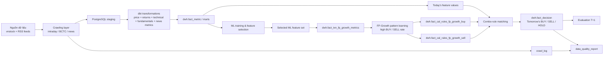

# Stock Project

Nền tảng dữ liệu và AI cho chứng khoán Việt Nam, tập trung vào một pipeline end-to-end gồm:

- Thu thập dữ liệu giá intraday, báo cáo tài chính ngân hàng và tin tức tài chính.
- Chuẩn hóa và tổng hợp dữ liệu bằng PostgreSQL + dbt.
- Sinh tín hiệu giao dịch `BUY` / `SELL` / `SILENT` bằng mô hình machine learning.
- Dùng các combo rule FP-Growth sau bước ML để xác nhận và giải thích tín hiệu.
- Theo dõi chất lượng dữ liệu hằng ngày để phát hiện sớm lỗi crawl, thiếu coverage hoặc đứt pipeline.

## 1. Mục tiêu của project

### Business goal

Project được xây để trả lời 4 câu hỏi chính:

1. Mỗi ngày thị trường đóng cửa xong, có thể tự động gom đủ dữ liệu đầu vào cho quyết định giao dịch ngày kế tiếp hay không?
2. Từ các feature đã được mô hình ML lựa chọn, có thể học được combo rule nào thường dẫn tới BUY hoặc SELL không?
3. Feature của ngày hôm nay đang khớp combo rule nào để dự đoán hành động cho phiên ngày mai?
4. Sau khi có dữ liệu phiên kế tiếp, hệ thống có thể tự đánh giá prediction đã đúng hay sai và theo dõi chất lượng pipeline không?

### Technical goal

Repo này được tổ chức như một mini data platform:

- `scripts/crawling`: lấy dữ liệu từ `vnstock` và RSS.
- `db`: DDL để dựng schema nguồn và kho dữ liệu.
- `dbt`: mô hình hóa dữ liệu cho analytics và ML serving.
- `scripts/ml`: huấn luyện, đánh giá và lựa chọn feature cho bài toán dự đoán.
- `scripts/fp_growth`: học combo rule từ feature ML và sinh dự đoán T+1.
- `airflow/dags`: orchestration lịch chạy.
- `scripts/data_quality_report.py`: lớp quan sát chất lượng dữ liệu.

## 2. Project giải quyết bài toán gì

Thay vì dự đoán giá đóng cửa tuyệt đối, project đang đi theo hướng thực dụng hơn:

- Gom feature hằng ngày cho từng mã.
- Dùng ML để xác định tập feature có giá trị cho bài toán dự báo.
- Dùng FP-Growth học các combo feature có tỷ lệ BUY/SELL cao.
- Match feature ngày hiện tại với combo rule để tạo quyết định cho phiên kế tiếp:
  - `BUY`: kỳ vọng tăng đủ mạnh.
  - `SELL`: kỳ vọng giảm đủ mạnh.
  - `SILENT`: không có edge đủ rõ để hành động.

Song song với đó, project còn khai phá các tổ hợp điều kiện kiểu:

- `rsi_14=low` và `macd_hist=high`
- `bb_percent_b_20=low` và `return_3d=high`

Nếu các tổ hợp này có win-rate cao trong dữ liệu lịch sử, chúng được lưu lại để quét xem hôm nay có mã nào đang rơi đúng pattern đó không.

## 3. Kiến trúc tổng thể



## 4. Luồng dữ liệu chính

### 4.1. Crawling layer

`scripts/crawling/crawl_intraday.py`

- Crawl giá nến `1m` cho toàn bộ mã active trong `staging.dim_symbol`.
- Thử source theo thứ tự `VCI -> KBS`.
- Ghi vào `staging.fact_stock_price_intraday`.
- Log trạng thái vào `staging.crawl_log`.

`scripts/crawling/crawl_bctc.py`

- Crawl báo cáo tài chính cho nhóm ngân hàng active.
- Lấy các nhóm báo cáo `BS`, `IS`, `CF`, `RATIO`.
- Có cơ chế retry, crawl 2 pass và validate coverage sau khi chạy.
- Ghi vào `staging.fact_financials`.

`scripts/crawling/crawl_news.py`

- Crawl RSS từ `CafeF`, `VnExpress`, `VnEconomy`.
- Tính sentiment score theo bộ từ khóa trong `staging.dim_news_keyword`.
- Phát hiện mã cổ phiếu bằng ticker regex và alias dictionary.
- Ghi raw article vào `staging.fact_news_article`.
- Ghi quan hệ article-symbol vào `staging.bridge_news_symbol`.

`scripts/crawling/build_news_features.py`

- Tổng hợp sentiment theo ngày cho từng mã và toàn thị trường.
- Sinh các window `T1`, `T3`, `T7`.
- Upsert vào `dwh.fact_news_sentiment_daily`.
- Đồng thời ghi các news metric vào `dwh.fact_metric`.

### 4.2. Transformation layer

`dbt` là lớp biến dữ liệu thô thành feature table dùng cho analytics và ML.

Các model nổi bật:

- `int_price_daily.sql`: gom giá intraday thành daily grain.
- `int_price_with_return.sql`: tính return lịch sử và return tương lai.
- `int_technical_indicator.sql`: SMA, EMA, RSI, MACD, Bollinger Bands, volume indicators, OBV.
- `int_fundamental_pivot.sql`: pivot dữ liệu BCTC long-format sang feature columns.
- `fact_metric.sql`: chuẩn hóa toàn bộ metrics vào một fact table dài theo grain:
  - `symbol_key`
  - `period_date`
  - `period_type`
  - `metric_code`

### 4.3. ML layer

ML không ghi trực tiếp vào `dwh.fact_decision`.

- Huấn luyện và đánh giá mô hình trên dữ liệu lịch sử.
- Xác định tập feature có giá trị cho bài toán dự báo T+1.
- Chuyển tập feature/điều kiện đã chọn thành dữ liệu transaction cho FP-Growth.

`scripts/ml/update_actual_returns.py`

- Lấy prediction ở ngày `T`.
- Chờ dữ liệu của phiên giao dịch kế tiếp (`T+1`).
- Đối chiếu với `return_1d` / `return_next_1d` trong kho dữ liệu.
- Cập nhật `actual_direction`, `is_correct`, `evaluated_at`.

### 4.4. FP-Growth layer

FP-Growth chỉ được thực hiện sau bước ML. Hệ thống lấy tập feature đã được dùng trong mô hình ML, chuyển thành transaction rule và học các tổ hợp điều kiện có tỷ lệ BUY hoặc SELL cao.

`scripts/fp_growth/append_likely_rules.py`

- Nhận tập feature dùng bởi mô hình ML.
- Chuyển các feature/điều kiện thành transaction trong `dwh.fact_txn_fp_growth_metrics`.
- Dùng PySpark FP-Growth học các pattern có confidence và lift BUY/SELL cao.
- Ghi rule vào `dwh.fact_cal_rules_fp_growth_buy` và `dwh.fact_cal_rules_fp_growth_sell`.
- Cập nhật rule tổng hợp thông qua procedure trong database.

`scripts/fp_growth/predict.py`

- Lấy feature của ngày giao dịch hiện tại từ `dwh.fact_metric`.
- Đọc combo rule từ hai bảng BUY/SELL trong database.
- Đưa feature hôm nay của từng mã vào bước combo-rule matching.
- Xác định rule BUY hoặc SELL nào đang khớp.
- Chọn kết quả theo confidence/lift của combo phù hợp nhất.
- Ghi dự đoán cho phiên ngày mai trực tiếp vào `dwh.fact_decision`.

### 4.5. Monitoring layer

`scripts/data_quality_report.py`

- Tổng hợp crawl log 24h gần nhất.
- Kiểm tra gap dữ liệu intraday.
- Kiểm tra coverage BCTC.
- Kiểm tra coverage news.
- Kiểm tra tình trạng prediction / evaluation gần đây.

## 5. Cấu trúc thư mục

```text
stock_project/
├── airflow/
│   ├── dags/
│   └── README.md
├── db/
│   ├── ddl_staging.sql
│   ├── ddl_dw.sql
│   ├── ddl_fact_decision.sql
│   ├── ddl_fact_cal_ruls_fp_growth.sql
│   ├── ddl_news_keyword.sql
│   └── ddl_news_sentiment.sql
├── dbt/
│   ├── dbt_project.yml
│   ├── models/
│   │   ├── staging/
│   │   ├── intermediate/
│   │   └── marts/
│   ├── macros/
│   └── tests/
├── docs/
├── scripts/
│   ├── crawling/
│   ├── fp_growth/
│   ├── ml/
│   └── data_quality_report.py
├── PROJECT_DOCUMENTATION.md
└── run_backfill.py
```

## 6. Công nghệ sử dụng

| Thành phần | Công nghệ |
|---|---|
| Ingestion | Python, `vnstock`, RSS, `requests`, `BeautifulSoup` |
| Database | PostgreSQL |
| Transform | dbt |
| ML inference | Python, `scikit-learn`, `xgboost` |
| Pattern mining | PySpark FP-Growth |
| Orchestration | Airflow DAGs, hoặc Windows Task Scheduler |
| Monitoring | Python console report |

## 7. Data model cốt lõi

### Staging schema

Các bảng quan trọng:

- `staging.dim_symbol`: danh mục mã cổ phiếu đang theo dõi.
- `staging.fact_stock_price_intraday`: giá intraday.
- `staging.fact_financials`: financial statements ở dạng long-format.
- `staging.fact_news_article`: raw news articles.
- `staging.bridge_news_symbol`: mapping bài viết với mã cổ phiếu.
- `staging.dim_news_keyword`: từ khóa sentiment.
- `staging.dim_symbol_alias`: alias để match bài viết với ticker.
- `staging.crawl_log`: log từng đợt crawl.

### DWH schema

Các bảng quan trọng:

- `dwh.fact_metric`: metric table trung tâm cho giá, return, technical, fundamentals, news features.
- `dwh.fact_news_sentiment_daily`: sentiment feature theo ngày.
- `dwh.fact_decision`: dự đoán T+1 được sinh sau bước combo-rule matching.
- `dwh.fact_txn_fp_growth_metrics`: dữ liệu transaction dùng để khai phá combo rule.
- `dwh.fact_cal_rules_fp_growth_buy`: combo rule xác nhận tín hiệu BUY.
- `dwh.fact_cal_rules_fp_growth_sell`: combo rule xác nhận tín hiệu SELL.

## 8. Kết quả đầu ra của project

Sau khi pipeline chạy ổn, bạn sẽ có các đầu ra chính sau:

1. Một kho dữ liệu cổ phiếu Việt Nam có daily metrics và annual fundamentals.
2. Một bảng quyết định giao dịch `dwh.fact_decision`, được ghi sau khi feature hôm nay khớp combo rule BUY/SELL.
3. Hai bảng combo rule BUY/SELL để giải thích và xác nhận decision sau bước ML.
4. Kết quả combo-rule matching được cập nhật trực tiếp vào `dwh.fact_decision`.
5. Một báo cáo chất lượng dữ liệu hằng ngày để theo dõi sức khỏe hệ thống.

## 9. Tình trạng hiện tại của repo

Phần này quan trọng vì README nên phản ánh đúng codebase hiện tại, không chỉ ý định thiết kế.

### Đã có sẵn

- Hầu hết crawling scripts đã chạy được ở dạng Python script.
- dbt project đã có model, test và source definitions.
- ML inference script đã có sẵn.
- FP-Growth mining và scan đã có sẵn.
- Có model artifacts trong `scripts/ml/models/`.
- Có DAG cho các luồng daily, weekly và monitoring.

### Chưa hoàn chỉnh hoặc cần lưu ý

- DAG `ml_weekly_maintenance_dag.py` đang gọi `train_model.py`, nhưng trong repo hiện tại chỉ thấy `scripts/ml/train_model.ipynb`.
- `predict.py` mặc định đọc từ `dwh.fact_cleaned_metric`, nhưng model này không xuất hiện trực tiếp trong `dbt/models/` hiện tại. Nghĩa là môi trường chạy thật có thể đang có một bảng/view ngoài repo, hoặc bạn cần tự alias / materialize thêm.
- Tài liệu cũ trong repo có vài chỗ không còn khớp 100% với code hiện tại; README này ưu tiên bám vào scripts và DAG đang tồn tại.
- Airflow chạy native trên Windows không ổn định; thư mục `airflow/README.md` khuyến nghị dùng Task Scheduler hoặc WSL2 / Linux.

## 10. Yêu cầu hệ thống

### Khuyến nghị

- Python `3.11+`
- PostgreSQL `14+`
- dbt Core + adapter Postgres
- Java / Spark runtime nếu muốn chạy FP-Growth
- Linux hoặc WSL2 nếu muốn chạy Airflow nghiêm túc

### Môi trường phát triển khả thi

| Nền tảng | Trạng thái |
|---|---|
| Windows + chạy script thủ công | Phù hợp để dev và test từng phần |
| Windows + Task Scheduler | Phù hợp để chạy lịch đơn giản |
| WSL2 / Ubuntu | Phù hợp để chạy gần môi trường production |
| Linux server | Phù hợp nhất cho Airflow và scheduler |

## 11. Setup từ đầu

### Bước 1. Clone repo

```bash
git clone <your-repo-url>
cd stock_project
```

### Bước 2. Chuẩn bị PostgreSQL

Tạo database riêng cho project, ví dụ:

```sql
CREATE DATABASE stock_analytics;
```

Sau đó chạy các DDL trong thư mục `db/`.

Thứ tự khuyến nghị:

1. `db/ddl_staging.sql`
2. `db/ddl_crawl_log.sql`
3. `db/ddl_news_keyword.sql`
4. `db/ddl_news_sentiment.sql`
5. `db/ddl_fact_decision.sql`
6. `db/ddl_fact_cal_ruls_fp_growth.sql`

`db/ddl_dw.sql` là tài liệu DWH cũ hơn và có giá trị tham khảo, nhưng nếu dùng dbt làm nguồn chân lý cho `fact_metric` và marts thì bạn nên ưu tiên schema do dbt materialize.

### Bước 3. Tạo file môi trường

Repo hiện đọc `.env` ở nhiều vị trí khác nhau, chủ yếu trong:

- `scripts/crawling/.env`
- `scripts/ml/.env`
- hoặc `.env` ở root

Tối thiểu bạn cần các biến sau:

```env
DB_HOST
DB_PORT
DB_USER
DB_PASSWORD
DB_NAME

DB_SCHEMA
DB_SCHEMA_DWH

VNSTOCK_API_KEY

BCTC_MIN_YEAR
NEWS_REQUEST_TIMEOUT
NEWS_VERIFY_SSL

FACT_FINANCIAL_TABLE
DIM_SYMBOL
FACT_CLEANED_METRIC_TABLE
FACT_DECISION_TABLE

FP_MIN_SUPPORT
FP_MIN_CONFIDENCE
FP_NUM_BINS
FP_TOP_K
FP_MIN_COVERAGE
FP_LOOKBACK_DAYS
FP_MAX_FEATURES
FP_MAX_ITEMS_PER_TX
```

### Bước 4. Tạo virtual environments

Repo đang tổ chức dependency theo module, nên cách an toàn nhất là dùng venv riêng cho từng khối.

#### Crawling

Windows:

```powershell
cd scripts\crawling
python -m venv cr_venv
.\cr_venv\Scripts\activate
pip install -r cr_requirements.txt
```

Linux / WSL:

```bash
cd scripts/crawling
python -m venv cr_venv
source cr_venv/bin/activate
pip install -r cr_requirements.txt
```

#### ML

Windows:

```powershell
cd scripts\ml
python -m venv ml_venv
.\ml_venv\Scripts\activate
pip install -r requirements.txt
```

Linux / WSL:

```bash
cd scripts/ml
python -m venv ml_venv
source ml_venv/bin/activate
pip install -r requirements.txt
```

#### FP-Growth

Windows:

```powershell
cd scripts\fp_growth
python -m venv fpvenv
.\fpvenv\Scripts\activate
pip install -r requirements.txt
```

Linux / WSL:

```bash
cd scripts/fp_growth
python -m venv fpvenv
source fpvenv/bin/activate
pip install -r requirements.txt
```

#### dbt

Ví dụ với Postgres adapter:

```bash
python -m venv dbt_venv
source dbt_venv/bin/activate
pip install dbt-core dbt-postgres
```

Trên Windows thay `source .../bin/activate` bằng `.\dbt_venv\Scripts\activate`.

### Bước 5. Cấu hình dbt profile

`dbt/dbt_project.yml` dùng profile name là `stock_analytics`.

Bạn cần tạo `profiles.yml` ở thư mục mặc định của dbt, ví dụ:

```yaml
stock_analytics:
  target: dev
  outputs:
    dev:
      type: postgres
      host: localhost
      port: 5432
      user: your_user
      password: your_password
      dbname: stock_analytics
      schema: staging
      threads: 4
```

Kiểm tra:

```bash
cd dbt
dbt debug
```

## 12. Quick start

Nếu bạn chỉ muốn dựng thử pipeline end-to-end nhanh nhất, làm theo thứ tự này:

1. Dựng database và các bảng staging / dwh cần thiết.
2. Chạy crawl intraday.
3. Chạy crawl BCTC.
4. Chạy crawl news.
5. Chạy build news features.
6. Chạy `dbt run`.
7. Huấn luyện/đánh giá ML để xác định tập feature.
8. Chạy `append_likely_rules.py` để học combo rule.
9. Chạy `scripts/fp_growth/predict.py` để dự đoán phiên ngày mai.
10. Sau khi có dữ liệu phiên giao dịch kế tiếp, chạy `update_actual_returns.py`.
11. Chạy `data_quality_report.py` để kiểm tra hệ thống.

## 13. Cách chạy từng phần

### 13.1. Crawl intraday

```bash
cd scripts/crawling
python crawl_intraday.py
```

Kết quả:

- insert / upsert vào `staging.fact_stock_price_intraday`
- log vào `staging.crawl_log`

### 13.2. Crawl báo cáo tài chính

Chạy toàn bộ bank universe:

```bash
cd scripts/crawling
python crawl_bctc.py
```

Chạy một mã cụ thể:

```bash
cd scripts/crawling
python crawl_bctc.py --symbol VCB
```

Kết quả:

- upsert vào `staging.fact_financials`
- summary coverage in console
- log vào `staging.crawl_log`

### 13.3. Crawl news

```bash
cd scripts/crawling
python crawl_news.py
```

Kết quả:

- upsert vào `staging.fact_news_article`
- upsert vào `staging.bridge_news_symbol`
- log từng feed vào `staging.crawl_log`

### 13.4. Build news features

```bash
cd scripts/crawling
python build_news_features.py --days-back 45
```

Kết quả:

- upsert vào `dwh.fact_news_sentiment_daily`
- ghi news metrics vào `dwh.fact_metric`

### 13.5. Chạy dbt

```bash
cd dbt
dbt run
dbt test
```

Repo hiện có test kiểm tra:

- unique grain cho `int_price_daily`
- unique grain cho `fact_metric`
- fundamentals chỉ được gắn `period_type = 'annual'`

### 13.6. ML training và feature selection

ML được dùng để huấn luyện, đánh giá và xác định tập feature đầu vào cho FP-Growth. Bước này không ghi prediction vào `dwh.fact_decision`.

### 13.7. Đánh giá prediction sau T+1

Mặc định script tự tìm ngày cần đánh giá:

```bash
cd scripts/ml
python update_actual_returns.py
```

Hoặc đánh giá cho một ngày cụ thể:

```bash
cd scripts/ml
python update_actual_returns.py --date 2026-03-10
```

### 13.8. Học combo rules từ feature ML

```bash
cd scripts/fp_growth
python append_likely_rules.py
```

Kết quả:

- tạo transaction rule từ tập feature dùng trong ML
- học các pattern có tỷ lệ BUY/SELL cao
- ghi combo BUY vào `dwh.fact_cal_rules_fp_growth_buy`
- ghi combo SELL vào `dwh.fact_cal_rules_fp_growth_sell`

### 13.9. Dự đoán phiên ngày mai

Chạy sau khi FP-Growth đã cập nhật các combo rule BUY/SELL.

Sinh dự đoán từ feature ngày mới nhất:

```bash
cd scripts/fp_growth
python predict.py --write-db --signals-only
```

Kết quả:

- match feature hôm nay với combo rule BUY/SELL
- dự đoán `BUY` / `SELL` / `HOLD` cho phiên ngày mai
- ghi kết quả vào `dwh.fact_decision`

### 13.10. Chạy data quality report

```bash
cd scripts
python data_quality_report.py
```

## 14. Orchestration

### Airflow DAGs hiện có

| DAG | Lịch chạy | Vai trò |
|---|---|---|
| `prediction_dag` | hằng ngày sau market close | `feature hiện tại -> combo-rule matching -> fact_decision -> notification` |
| `stock_crawl_news` | hằng ngày `01:30` | crawl news và build news features |
| `stock_crawl_financial_statements` | hằng ngày `02:00` | crawl BCTC |
| `ml_evaluate_predictions` | hằng ngày | cập nhật actual returns |
| `ml_weekly_maintenance` | Chủ nhật `03:00` | retrain model và mine patterns |
| `data_quality_report` | ngày làm việc | báo cáo chất lượng dữ liệu |

### Lưu ý quan trọng về Airflow

- DAG paths đang giả định môi trường Linux kiểu `/opt/stock_project/...`.
- Trên Windows, repo này đã có tài liệu khuyến nghị dùng Task Scheduler thay vì Airflow native.
- Nếu triển khai production nghiêm túc, nên chạy trên Linux hoặc WSL2.

## 15. Backfill lịch sử

Repo có utility `run_backfill.py`.

Mục đích:

- patch tạm `dbt/models/marts/fact_metric.sql`
- patch macro indicator
- chạy `dbt run` theo từng năm
- restore file gốc sau khi xong

Lưu ý:

- đây là utility tác động trực tiếp vào file model rồi restore lại sau
- chỉ nên dùng khi bạn hiểu rõ flow backfill và đã backup môi trường

## 16. Mô hình ML hiện dùng gì

Từ notebook và artifacts hiện có, project đang dùng hướng tiếp cận:

- model dạng classifier
- nhãn:
  - `0 = SILENT`
  - `1 = BUY`
  - `2 = SELL`
- target được sinh từ `return_next_1d`
- thresholds hiện thấy trong code:
  - `BUY` nếu return vượt ngưỡng dương
  - `SELL` nếu return nhỏ hơn ngưỡng âm
  - còn lại là `SILENT`

Artifacts hiện có trong `scripts/ml/models/`:

- `trading_model_latest.pkl`
- `model_v1.pkl` đến `model_v4.pkl`
- `feature_cols.pkl`

## 17. Cách hiểu output thực tế

### `dwh.fact_decision`

Đây là bảng kết quả cuối cùng sau khi feature hôm nay được match với combo rule để dự đoán phiên kế tiếp.

Ví dụ các cột hữu ích:

- `symbol_key`
- `trade_date`
- `predicted_label`
- `actual_direction`
- `is_correct`
- `model_version`
- `entry_window`

### Combo-rule tables

Hai bảng `dwh.fact_cal_rules_fp_growth_buy` và `dwh.fact_cal_rules_fp_growth_sell` là lớp giải thích và xác nhận sau ML:

- combo điều kiện nào đã được khai phá cho BUY hoặc SELL
- confidence và lift của từng combo
- các cờ `x1` đến `x16` xác định điều kiện bắt buộc của rule
- rule nào đang khớp với prediction hiện tại

## 18. Kiểm thử và validation

### dbt tests

```bash
cd dbt
dbt test --select fact_metric int_price_daily
```

### Validation thủ công nên làm

1. Kiểm tra `staging.crawl_log` sau mỗi lần crawl.
2. Kiểm tra số lượng mã active có đủ trong `staging.dim_symbol`.
3. Kiểm tra `dwh.fact_metric` có cập nhật tới ngày mới nhất hay chưa.
4. Kiểm tra `dwh.fact_decision` đã có prediction cho ngày gần nhất chưa.
5. Kiểm tra hai bảng `dwh.fact_cal_rules_fp_growth_buy` và `dwh.fact_cal_rules_fp_growth_sell` có dữ liệu chưa.
6. Kiểm tra `dwh.fact_decision` đã được cập nhật sau combo-rule matching chưa.

## 19. Các known issues / rủi ro kỹ thuật

1. Một số tài liệu trong repo nhắc tới `train_model.py`, nhưng file này hiện chưa có trong `scripts/ml/`.
2. `predict.py` phụ thuộc `fact_cleaned_metric`; bạn cần xác minh bảng này trong môi trường thật.
3. `dbt/models/marts/fact_metric.sql` hiện có dấu hiệu từng bị patch nhiều lần cho backfill, nên cần review kỹ trước khi productionize.
4. Repo đang dùng nhiều `.env` theo module; nếu không thống nhất sẽ rất dễ lệch config giữa crawling, ML và FP-Growth.
5. Airflow DAG mô tả lịch chạy và path khá rõ, nhưng nếu chạy trên Windows native sẽ dễ gặp vấn đề môi trường.
6. Notebook training chưa được chuyển hoàn toàn thành training pipeline reproducible qua CLI.

## 20. Tham khảo khi viết README này

README này được tổ chức theo hướng rõ mục tiêu, quick start, architecture, data model, output và operational notes. Bố cục được tham khảo tinh thần từ các README/data project public trên GitHub và tài liệu chính thức của các ecosystem liên quan, đặc biệt là:

- [DataTalksClub / data-engineering-zoomcamp](https://github.com/DataTalksClub/data-engineering-zoomcamp)
- [dbt Labs / dbt-core](https://github.com/dbt-labs/dbt-core)
- [Apache Airflow](https://github.com/apache/airflow)

Phần nội dung nghiệp vụ, luồng dữ liệu và caveat triển khai trong README này được đối chiếu chủ yếu từ chính codebase hiện tại của repo.

## 21. Gợi ý thứ tự đọc repo

Nếu bạn là người mới vào project, nên đọc theo thứ tự:

1. README này
2. `PROJECT_DOCUMENTATION.md`
3. `db/`
4. `dbt/models/`
5. `scripts/crawling/`
6. `scripts/ml/`
7. `scripts/fp_growth/`
8. `airflow/dags/`

## 22. Web application

Project đi kèm một ứng dụng web phục vụ việc theo dõi tín hiệu và phân tích từng mã cổ phiếu.

### Frontend

Frontend nằm tại `web_stock_prediction/frontend` và được xây bằng:

- Next.js 14 App Router
- React 18 + TypeScript
- Tailwind CSS
- Lightweight Charts cho biểu đồ nến
- Recharts cho technical indicators

Các màn hình chính:

- `/`: trang tổng quan và danh sách ứng viên giao dịch.
- `/predictions`: biểu đồ nến, technical analysis, prediction hiện tại và validation history.
- `/signals`: danh sách tín hiệu.
- `/model-metrics`: accuracy và confusion matrix.
- `/data-explorer`: khám phá dữ liệu từ warehouse.
- `/news`: tin tức thị trường.
- `/register`: đăng ký quyền truy cập.

Trang prediction hỗ trợ:

- Tìm kiếm mã theo ticker hoặc tên doanh nghiệp.
- Hiển thị danh sách symbol trực tiếp từ `staging.dim_symbol`.
- Nến ngày, tháng, quý, nửa năm, năm và toàn bộ lịch sử.
- Zoom biểu đồ bằng con lăn chuột.
- Technical indicators lấy từ `dwh.fact_metric`.
- Prediction và validation history lấy từ `dwh.fact_decision`.
- Thông báo rõ khi Airflow chưa sinh prediction mới.

### Backend API

Backend nằm tại `web_stock_prediction/backend` và được xây bằng FastAPI, SQLAlchemy và PostgreSQL.

Chạy API local:

```bash
cd web_stock_prediction/backend
python -m venv venv
source venv/bin/activate
pip install -r requirements.txt
uvicorn app.main:app --host 0.0.0.0 --port 8000
```

Trên Windows:

```powershell
cd web_stock_prediction\backend
python -m venv benv
.\benv\Scripts\activate
pip install -r requirements.txt
uvicorn app.main:app --host 0.0.0.0 --port 8000
```

Các nhóm endpoint chính:

| Endpoint | Chức năng |
|---|---|
| `GET /health` | Health check |
| `GET /api/predictions/symbols` | Danh sách mã có trong database |
| `GET /api/predictions/candles/{symbol}` | Dữ liệu OHLC đã aggregate theo kỳ |
| `GET /api/predictions/technical/{symbol}` | Technical indicators |
| `GET /api/predictions/current/{symbol}` | Prediction hiện tại |
| `GET /api/predictions/{symbol}` | Validation history |
| `GET /api/predictions/financials/{symbol}` | Dữ liệu tài chính |
| `GET /api/dashboard/kpis` | KPI tổng quan |
| `GET /api/model-metrics/summary` | Model metrics |
| `GET /api/news/latest` | Tin tức mới nhất |

FastAPI Swagger UI có tại:

```text
http://localhost:8000/docs
```

### Chạy frontend local

Tạo `web_stock_prediction/frontend/.env.local`:

```env
NEXT_PUBLIC_API_BASE_URL=http://localhost:8000
```

Sau đó:

```bash
cd web_stock_prediction/frontend
npm install
npm run dev
```

Truy cập:

```text
http://localhost:3000
```

Build production:

```bash
npm run build
npm run start -- -H 0.0.0.0 -p 3000
```

## 23. Biến môi trường

Không commit `.env` thật lên GitHub. Tạo file `.env` ở root project với các biến tối thiểu:

```env
DB_HOST=localhost
DB_PORT=5432
DB_USER=postgres
DB_PASSWORD=change_me
DB_NAME=stock_analytics
DB_SCHEMA_STAGING=staging
DB_SCHEMA_DWH=dwh

CORS_ORIGINS=http://localhost:3000
```

Frontend production dùng:

```env
NEXT_PUBLIC_API_BASE_URL=http://your-host:8000
```

## 24. Bảo mật trước khi public

Trước mỗi lần push hoặc deploy:

1. Không commit `.env`, API key, database password hoặc private key.
2. Không commit `node_modules`, virtualenv, `.next`, dbt target và Airflow logs.
3. Không mở PostgreSQL `5432` ra Internet nếu không thực sự cần.
4. Giới hạn `CORS_ORIGINS` theo domain frontend.
5. Thay các mật khẩu đã từng xuất hiện trong terminal hoặc repository history.
6. Chạy `git status` và kiểm tra từng file trước khi commit.

## 25. License và ghi chú

Repo hiện chưa thấy file `LICENSE` ở root. Nếu bạn định public project này trên GitHub, nên bổ sung license phù hợp và che toàn bộ secrets trong `.env` trước khi push.
